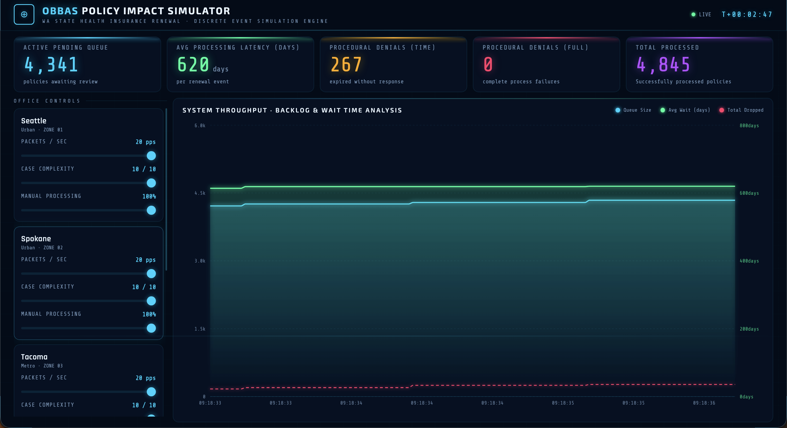

# Medicaid Renewal Processing Simulator

A discrete-event simulation of Washington State's Medicaid renewal pipeline, built to model how staffing levels, case complexity, and automation tools affect processing throughput and procedural denials.



## Motivation

Each year, thousands of Medicaid enrollees lose coverage not because they are ineligible, but because their renewal paperwork expires in a backlogged queue — a **procedural denial**. This simulator models the HCA (Health Care Authority) renewal pipeline as a queuing system, letting users stress-test different scenarios: surge volumes from specific offices, high-complexity caseloads, or reduced automation (manual processing), and observe in real time where the system breaks down.

## Architecture

The simulation has three layers that communicate over TCP and WebSocket:

```
[React Dashboard] <--WebSocket--> [Python Bridge] <--TCP--> [C Server (HCA)]
                                        |
                                  [5 Office Clients]
                                  (one thread per zone)
```

- **C Server** — Simulates the HCA processing backend. Accepts Medicaid renewal packets from office clients, queues them, and fans out to 10 parallel worker threads. Exposes live metrics over a separate TCP port.
- **Python Bridge** (`stat_client.py`) — Simulates 5 regional offices (CSOs), each generating renewal packets at configurable rates. Also acts as a WebSocket server relaying live metrics to the frontend and forwarding config changes back to the office clients.
- **React Frontend** — Live operator dashboard. Displays queue depth, processing latency, and dropped-case counts. Provides per-zone sliders to adjust renewal volume, case complexity, and manual processing ratio in real time.

## Key Technical Features

- **Binary TCP protocol** — Medicaid packets are serialized to an 18-byte big-endian binary format with explicit network byte order conversion, enabling interop between Python clients and the C server.
- **Thread-safe producer-consumer queue** — The C server uses a fixed-capacity circular queue (5,000 slots) protected by a `pthread_mutex` and signaled via `pthread_cond_t`. Worker threads block until work is available.
- **Poisson arrival model** — Each office client draws inter-arrival times from an exponential distribution (`random.expovariate(pps)`), accurately modeling a Poisson packet process.
- **Gaussian complexity distribution** — Case complexity is sampled from a Gaussian centered on the zone's configured mean, clamped to [1, 10].
- **Dual drop tracking** — The server distinguishes between two failure modes: cases dropped because the queue was full (`total_dropped_full`) and cases that expired in the queue before a worker picked them up (`total_dropped_time`, 60-second TTL).
- **Manual vs. automated processing** — Worker processing time scales as `complexity × (200ms manual | 15ms automated)`, capped at 4 seconds. This models the throughput impact of assistive technology on worker throughput.
- **EMA latency tracking** — The server maintains a running exponential moving average of per-case processing latency without storing historical data.
- **Live config hot-reload** — The React dashboard sends `UPDATE_CONFIG` messages over WebSocket; the Python bridge updates zone configs under a lock so simulated offices adjust their behavior without restarting.

## Tech Stack

| Layer | Technology |
|---|---|
| HCA Server | C (C99), pthreads, POSIX sockets |
| Office Clients / Bridge | Python 3.11, FastAPI, uvicorn, asyncio |
| Frontend Dashboard | React 19, TypeScript, Vite |
| Build | GNU Make (C), npm (frontend) |

## Running Locally

You need: `gcc`, `make`, Python 3.11+, and Node.js 18+.

**1. Build and start the C server**

```bash
make server
./server
```

The server listens for renewal packets on port `8080` and exposes metrics on port `5050`.

**2. Start the Python bridge**

```bash
python -m venv .venv
source .venv/bin/activate
pip install fastapi uvicorn
python stat_client.py
```

This spawns one office client thread per zone and starts the WebSocket bridge on port `9000`.

**3. Start the React dashboard**

```bash
cd Frontend
npm install
npm run dev
```

Open the URL printed by Vite (default `http://localhost:5173`). If you start the frontend before the Python bridge, refresh the page once the bridge is up to reconnect the WebSocket.

> **Start order:** C server → Python bridge → Frontend. Other orders work, but you may need to refresh the frontend to reconnect the WebSocket.

## Simulated Zones

| Zone | Location | Profile |
|---|---|---|
| 1 | Seattle (Urban) | High volume |
| 2 | Spokane (Urban) | High volume |
| 3 | Yakima (Rural) | Configurable |
| 4 | Bellingham (North) | Configurable |
| 5 | Olympia (Capital) | Configurable |

Each zone's renewal rate, case complexity, and manual/automated processing ratio can be adjusted live from the dashboard sliders.
